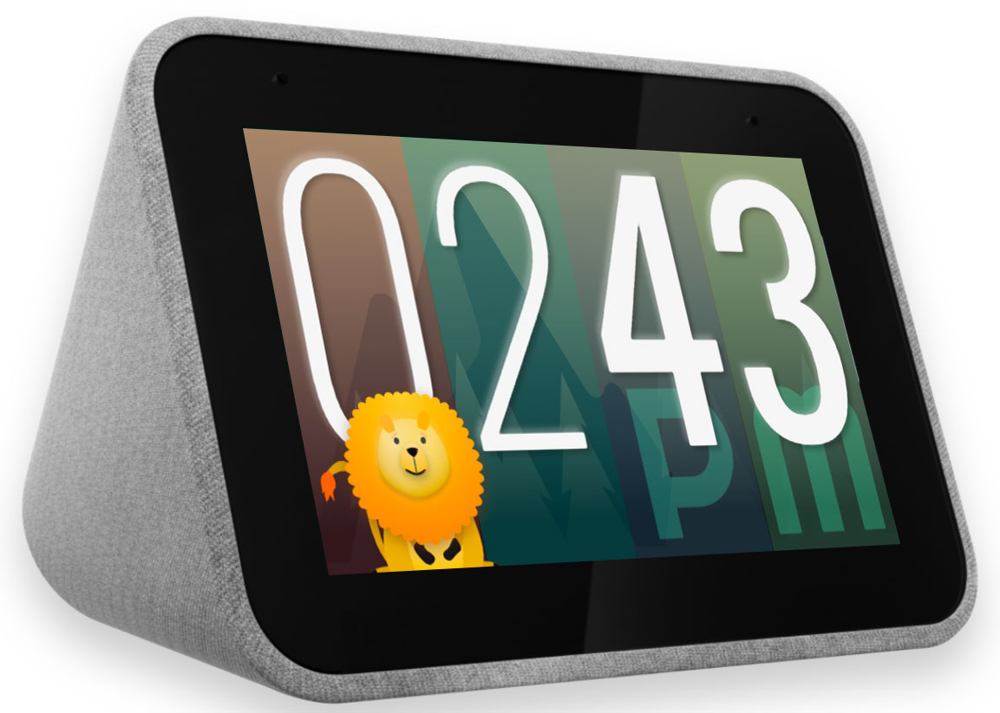
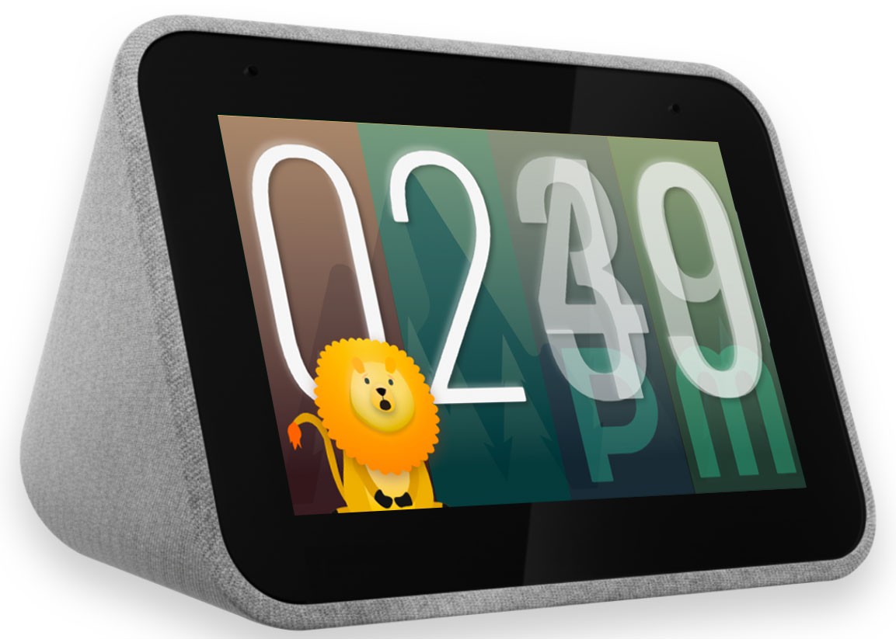

# Animal Clock

This app is a good example of how adding animations can liven up a digital clock.
The lion's head bobbles along without any care in the world.

That is, until the time change is detected at which point the lion gets startled. Don't worry - he will quickly go back to bobbling.

You might also catch other living animals pass through the scene, so keep your eyes open :- )

## About the UI

The animal clock uses the included "digital_clock" as the starting point. However, the resolution seems to be a bit inconsistent between iOS and Android as what works fine in Android overflows in iOS by 2px in width.

The animated characters were created in Flare (Rive.app) and imported using the flutter_flare plugin.

Many more animals were scheduled to be introduced, but due to lack of time, they will make their debuts in future versions.
